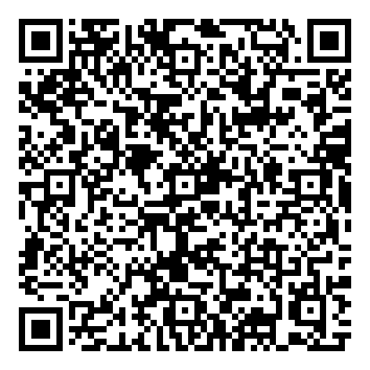
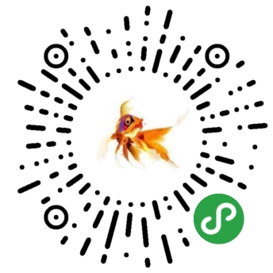

# 项目展示
## 1.Vue项目：Vue+Vuex+JavxaScript+Less+Axios+Vant框架

- **[eyepetizer](https://liuzhidon9.github.io/eyepetizer)(仿开眼视频移动端)**

  

- **[fakeNeteaseMusic](https://liuzhidon9.github.io/fakeNeteaseMusic)(仿网易音乐web移动端)**

## 2.微信小程序：WXSS+WXML+WXS+JavaScript+ES6语法

- **WordIsWide(短视频)**

  `因为个人号不能发布视频类型的小程序，所以改小程序未发布，只有体验版，扫码可申请体验使用。`

- **TTSpecch(文字转语音)**

  `已发布`

  

## 3.canvas+ES6语法

  - **[canvas 大球吃小球](https://liuzhidon9.github.io/ball/)**

## 4.HTML+JavaScript

- **[飞机Demo](https://liuzhidon9.github.io/myPlane/)**

## 5.BootStrap-Demo

- **[inva](https://liuzhidon9.github.io/inva)**
- **[model](https://liuzhidon9.github.io/模特/)**

## 6.CSS3动画效果

- **[加载动画和hover效果](https://liuzhidon9.github.io/roading/)**
- **[hoverDemo](https://liuzhidon9.github.io/卡片穿插/)**
- **[图表展示](https://liuzhidon9.github.io/图表/)**
- **[3D盒子](https://liuzhidon9.github.io/3dBox/)**

## 7.HTML5+JavaScript

- **[musicPlayer-Demo](https://liuzhidon9.github.io/musicplayer/)**
- **[可拖放列表](https://liuzhidon9.github.io/drop.html/)**

## 8.HTML+CSS

- **[tea-Demo](https://liuzhidon9.github.io/tea/)**
- **[farm-Demo](https://liuzhidon9.github.io/农场/)**

